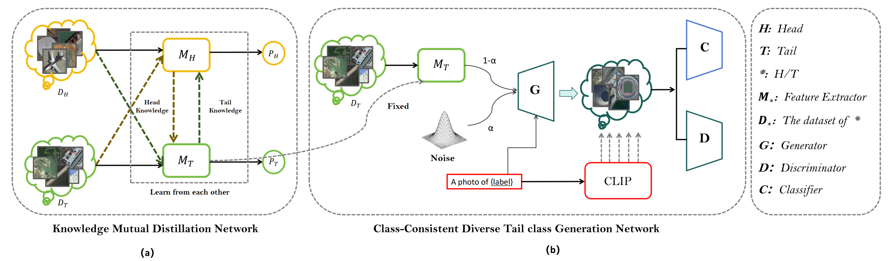
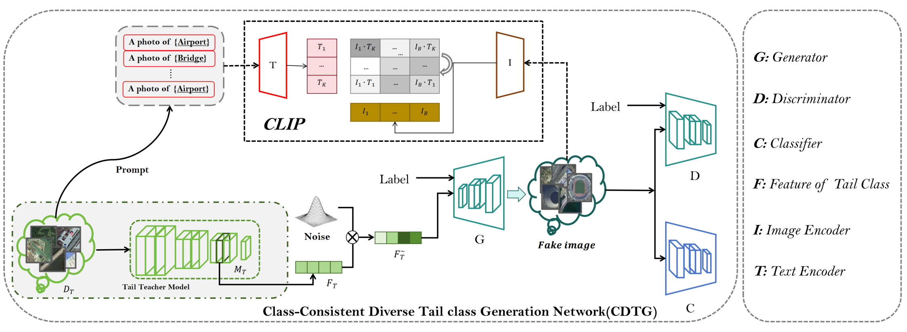
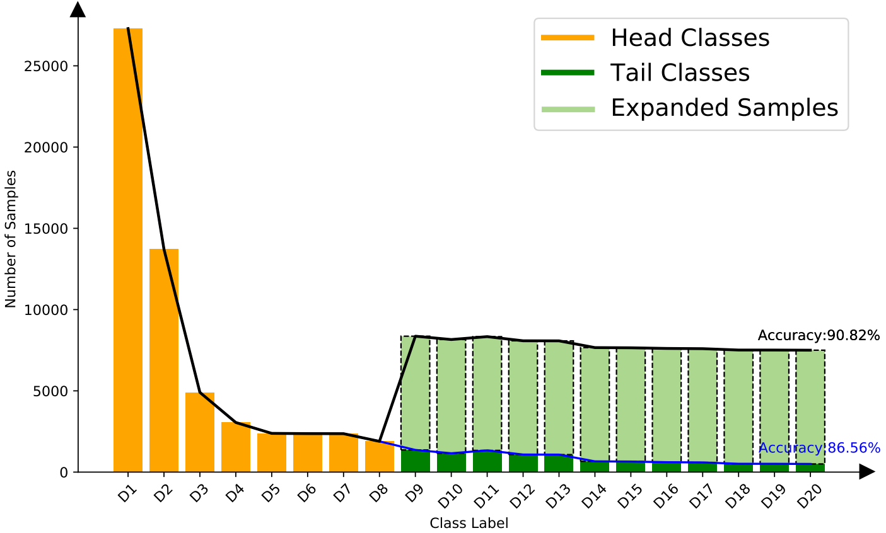

简体中文 | [English](README.md)

<div style="text-align: center; margin: 10px">
    <h1> ⭐ TGN: Text-Guided Diverse Image Synthesis for Long-Tailed Remote Sensing Object Classification </h1>
</div>
<p align="center">
    <a href="">
    
    </a>
    <a href="">
    
    </a>
    <a href=""></a>
    <a href=""></a>
    
    <a href="mailto: tanghaojun_cam@163.com">
    
    </a>
</p>

---

## 🌋  说明
本项目是我们发表在 <span style='color: #EB5353;font-weight:bold'>TGRS 2024</span> 的文章 "Text-Guided Diverse Image Synthesis for Long-Tailed Remote Sensing Object Classification"的官方实现。
您可以通过本项目快速复现我们的工作. 如果您有任何疑问，欢迎联系我们！




---

## 💡 引言
TGN comprises two main components: knowledge mutual
distillation network (KMDN) and class-consistent diverse tail
class generation network (CDTG). KMDN resolves the isolation
issue of the head and tail knowledge by facilitating mutual
learning of feature representations between the head and tail
data, thereby improving the feature extraction capability of
the tail model. CDTG focuses on generating class-consistency
diverse tail class images that uses tail-class features extracted
by KMDN. Especially, the class consistency is guaranteed by
CLIP’s powerful text-image alignment capability. These generated images are then added back into the original dataset to
alleviate the long-tailed distribution, thereby improving the tail
class accuracy.


<div align="center">
  
</div>

## 🚀 快速开始

### 📍 安装依赖

```bash
pip install -r requirements.txt
```

### 🏕️ 准备数据集

我们在DIOR、FGSC-23和DOTA三个遥感数据集上进行了实验。

- `DIOR`: 包含来自20个类别的192,465个图像，68,025个用于训练的样本和124,440个用于测试的样本。
- `FGSC`: 包含来自23个类别的4,081张图像，3,256个用于训练的样本和825个用于测试的样本。
- `DOTA`: 包含15个类别的127759张图片，98906个样本用于训练，28853个样本用于测试。

您可以从 [Datasets](https://pan.baidu.com/s/1HebHIjbNpGO0u4nrqu6Wag?pwd=wo4j)下载处理好的数据集; 提取码: `wo4j`

- 确保你的项目结构如下:

```
  ├── CDTG
  │   ├── checkpoint
  │   ├── lpips
  │   |   ...
  │
  ├── Classification
  │   ├── Datasets.py
  │   ├── model_finetune.py
  │   ├── test.py
  │   ├── train.py
  │   ├── Utils.py
  │ 
  ├── KMDN
  │   ├── dataset_split.py
  │   ├── Datasets.py
  │   ├── Distill.py
  │   ├── ....
  │
  ├── dior
  ├── DOTA
  ├── FGSC-23
  ├── README.md
  ├── requirements.txt
```

- 如果您想使用自己的数据集，请确保数据集具有以下相同的结构:
```
  ├── dior
  │   ├── anno
  │   │   ├── DIOR_train.txt
  │   │   ├── DIOR_test.txt
  │   │
  │   ├── train
  │   │   ├── 0
  │   │   │   ├── 00008_0.jpg
  │   │   │   ├── ...
  │   │   │   
  │   │   ├── 1
  │   │   ├── ...  
  │   │
  │   ├── test
  │   │   ├── 0
  │   │   │   ├── 11726_0.jpg
  │   │   │   ├── ...
  │   │   │   
  │   │   ├── 1
  │   │   ├── ... 
```

- 在开始之前，请执行以下命令划分头部数据集和尾部数据集:
- 
```bash
cd KMDN
python3 dataset_split.py
```

`注意:` dataset_split.py 在KMDN和CDTG中都存在, 但它们具有不同的功能!

### 🔥 准备预训练权重
我们提供了预训练的权重。您可以使用这些权重快速复现我们的工作。
- `result.pth`: 您可以使用这个权重来实现我们预训练的分类网络。这个权重是在一个数据集上训练的，这个数据集为每个尾类图像添加了7000个生成的样本。 [Baidu Netdisk](https://pan.baidu.com/s/1HoACbWxesL8cLWNvAw2EWw?pwd=ii10); 提取码: `ii10`.
- `200000.pt`:  您可以使用这个权重来生成尾类图像。 [Baidu Netdisk](https://pan.baidu.com/s/17nQJyromz4ap2lS4KfbQFA?pwd=9h1w); 提取码: `9h1w`.

### 🏕️ 测试

您可以使用以下命令快速重现我们的结果(`result.pth` 放在路径 "./Classification/save_model/result.pth"下):

```bash
cd Classification
python3 test.py
```

## 🦄 训练与评估
### 🔥 KMDN

- 首先，使用以下命令分别训练头尾模型:

```bash
cd KMDN
python3 dataset_split.py
python3 UModel.py
python3 RModel.py
```

- 然后执行如下命令，进行知识互蒸馏。

```bash
python3 Distill.py
```

### 🔥 CDTG
- CDTG所需的数据集结构如下:
```
  ├── dior
  │   ├── train
  │   │   ├── tail
  │   │   │   ├── 0
  │   │   │   │   ├── 00008_0.jpg
  │   │   │   │   ├── ...
  │   │   │   
  │   │   │   ├── 1
  │   │   │   ├── ...  
```

- 可以执行以下命令自动分割成该结构。

```bash
cd CDTG
python3 dataset_split.py
```

如果您需要使用自己的数据集，请确保它具有相同的结构。

- 执行如下命令训练CDTG:

```bash
python3  train.py  --ckpt  checkpoint/your_model_path 
```

### 🔥 生成

- 最后，您可以运行以下命令来生成不同类别的尾部图像:

```bash
cd CDTG
python3  generation.py  --ckpt  checkpoint/your_model_path  --folder_number  0  --r  0.05
```


- `folder_number:` 生成图像的类标签。
- `r:`  噪声比例

_`your_model_path` 可以替换为 `200000.pt`_

### 🔥 评估
使用以下命令在扩展的数据集上训练分类器:

```bash
cd Classification
python3  train.py
```

## Citation
如果您认为这项工作对您的研究有用，请引用我们的论文:
```
@article{TGRS2024tgn,
  title={Text-Guided Diverse Image Synthesis for Long-Tailed Remote Sensing Object Classification},
  author={Haojun Tang, Wenda Zhao, Guang Hu, Yi Xiao, Yunlong Li and Haipeng Wang},
  journal={arXiv preprint arXiv:2403.06122},
  year={2024}
}
```

## 致谢
- 这个存储库建立在[SatConcepts](https://github.com/kostagiolasn/SatConcepts)之上. 
- 感谢这些开源代码存储库作者所做的努力。并感谢ACs和审稿人在审阅我们论文时所付出的努力。
